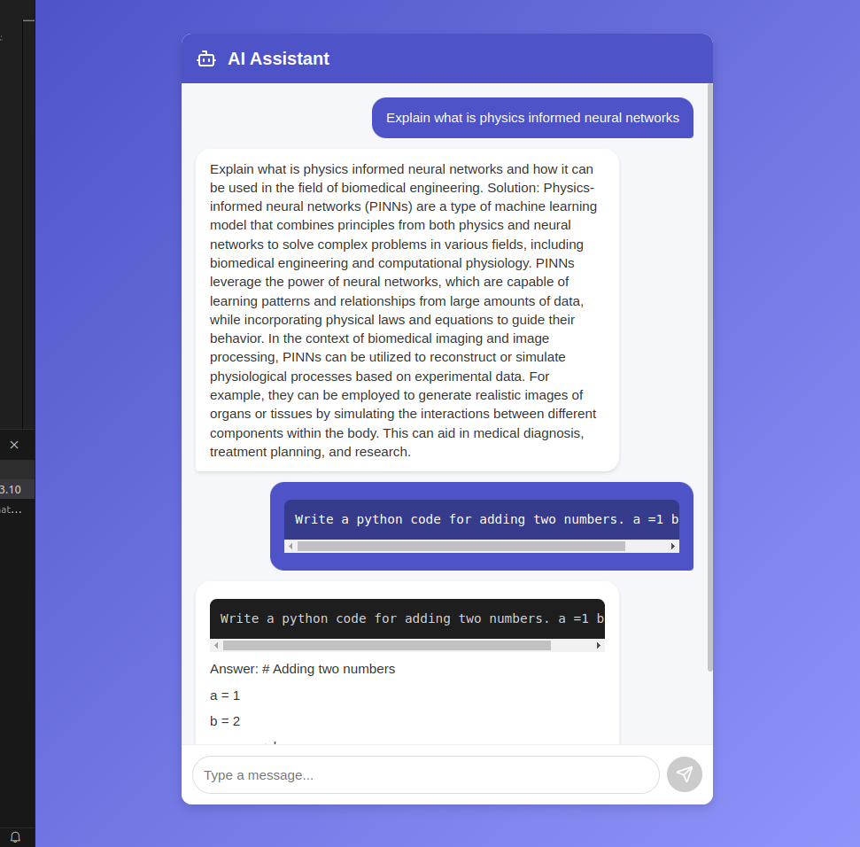

# AI Chatbot with FastAPI Backend and React Frontend

A modern chatbot application featuring a sleek user interface built with React and a robust FastAPI backend. The chatbot supports code syntax highlighting, copy-paste functionality, and real-time message updates.


## Features

- Modern, responsive UI design
- Code syntax highlighting with copy functionality
- Real-time message updates
- Smooth animations and transitions
- Mobile-friendly interface
- Python code execution support

## Project Structure

```
project-root/
├── frontend/                # React frontend
│   ├── src/
│   │   ├── components/
│   │   │   └── Chat.js     # Main chat component
│   │   ├── styles/
│   │   │   └── index.css   # Styling
│   │   ├── App.js
│   │   └── index.js
│   ├── package.json
│   └── README.md
│
└── backend/                 # FastAPI backend
    ├── app/
    │   ├── main.py
    │   └── api/
    └── requirements.txt
```

## Setup and Installation

### Backend Setup

1. Navigate to the backend directory:
```bash
cd backend
```

2. Create and activate a virtual environment:
```bash
python -m venv venv
source venv/bin/activate  # On Windows use: venv\Scripts\activate
```

3. Install dependencies:
```bash
pip install -r requirements.txt
```

4. Run the FastAPI server:
```bash
uvicorn app.main:app --reload
```

The backend will be running at `http://127.0.0.1:8000`

### Frontend Setup

1. Navigate to the frontend directory:
```bash
cd frontend/chatbot-ui
```

2. Install dependencies:
```bash
npm install
```

3. Start the development server:
```bash
npm start
```

The frontend will be running at `http://localhost:3000`

## Usage

1. Open your browser and navigate to `http://localhost:3000`
2. Start chatting with the AI assistant
3. For code-related queries, the response will include syntax-highlighted code blocks
4. Use the copy button to easily copy code snippets
5. Messages are automatically scrolled into view

## Code Block Features

The chatbot includes enhanced code block functionality:
- Syntax highlighting for Python code
- Copy to clipboard button
- Language indicator
- Dark theme for better readability
- Proper monospace font formatting


## Example Interactions

1. Simple code requests:
```
User: Give me python code to add two numbers
Bot: Here's a simple Python function to add two numbers:

def add_numbers(a, b):
    return a + b

# Example usage
result = add_numbers(5, 3)
print(result)  # Output: 8
```

2. Complex queries:
```
User: Explain what is physics informed neural networks
Bot: [Detailed explanation with formatted text]
```

## Development

### Frontend Development

The React frontend uses several key components:

- `Chat.js`: Main chat interface component
- `index.css`: Styling including code block formatting
- Lucide React icons for UI elements

To modify the UI:
1. Update `src/components/Chat.js` for component changes
2. Modify `src/styles/index.css` for styling updates

### Backend Development

The FastAPI backend handles:
- Chat request processing
- Response generation
- API endpoint management

## Contributing

1. Fork the repository
2. Create your feature branch (`git checkout -b feature/amazing-feature`)
3. Commit your changes (`git commit -m 'Add some amazing feature'`)
4. Push to the branch (`git push origin feature/amazing-feature`)
5. Open a Pull Request

## License

This project is licensed under the MIT License - see the LICENSE file for details.

## Acknowledgments

- FastAPI for the backend framework
- React for the frontend library
- Lucide React for icons
